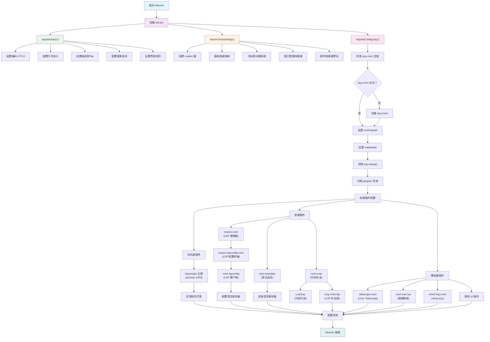

# Neovim Configuration

一个基于 Lua 的现代化 Neovim 配置，使用 lazy.nvim 作为插件管理器。

## 项目结构

```
/Users/liyong/.config/nvim/
├── .gitignore                          # Git 忽略文件
├── .idea/                              # JetBrains IDE 项目配置（可选）
│   ├── .gitignore
│   ├── modules.xml
│   ├── nvim.iml
│   └── vcs.xml
├── Dockerfile                          # Docker 容器配置
├── README.md                           # 项目说明文档
├── init.lua                            # Neovim 主配置入口
├── lua/                                # Lua 配置文件目录
│   ├── basic.lua                       # 基础设置配置
│   ├── config/                         # 配置模块
│   │   └── lazy.lua                    # lazy.nvim 插件管理器配置
│   ├── keybindings.lua                 # 按键绑定配置
│   └── plugins/                        # 插件配置目录
│       ├── code_completion_nvim-autopairs.lua    # 自动括号配对
│       ├── code_completion_nvim-cmp.lua           # 代码补全
│       ├── code_git_decorations_gitsigns.lua     # Git 装饰
│       ├── code_highlight_nvim-treesitter.lua    # 语法高亮
│       ├── code_snip_LuaSnip.lua                  # 代码片段
│       ├── colorscheme_tokyonight.lua             # 主题配色
│       ├── comment.lua                            # 代码注释
│       ├── dap_lua_one-small-step-for-vimkind.lua # Lua 调试适配器
│       ├── dap_nvim-dap.lua                       # 调试适配器协议
│       ├── finder_telescope.lua                   # 模糊查找
│       ├── greeter_dashboard_alpha-nvim.lua       # 启动页面
│       ├── help_document_neodev.lua               # Neovim 开发帮助
│       ├── indent_guides_indent-blankline.lua     # 缩进指示线
│       ├── keytips_which-key.lua                  # 按键提示
│       ├── lsp_server_manager_mason-lspconfig.lua # LSP 服务器配置
│       ├── lsp_server_manager_mason.lua           # LSP 服务器管理
│       ├── lsp_server_nvim-lspconfig.lua          # LSP 配置
│       ├── ui_buffer_tabpage_bufferline.lua       # 缓冲区标签页
│       ├── ui_component_lib_nui.lua               # UI 组件库
│       ├── ui_dressing.lua                        # UI 界面美化
│       ├── ui_icons_nvim-web-devicons.lua         # 文件图标
│       ├── ui_notice.lua                          # 通知系统
│       ├── ui_nvim-tree.lua                       # 文件浏览器
│       └── ui_status_line_lualine.lua             # 状态栏
└── test_dir/                           # 测试目录
    ├── test.c
    ├── test.cpp
    ├── test.lua
    └── test.py
```

## 启动流程

以下是 Neovim 配置的启动流程图，展示了各个模块的加载顺序和依赖关系：



### 启动阶段说明

1. **初始化阶段**: 加载核心配置文件
   - `init.lua` 作为入口点
   - 按顺序加载基础设置、按键绑定和插件管理器

2. **基础配置阶段**: 设置 Neovim 基本行为
   - 编码和界面设置
   - 编辑器行为配置
   - 搜索和导航选项

3. **按键绑定阶段**: 配置快捷键
   - 设置 Leader 键
   - 重映射基础操作
   - 预设插件快捷键

4. **插件管理器初始化**: 准备插件环境
   - 检查并安装 lazy.nvim
   - 设置插件加载路径
   - 扫描插件配置

5. **插件加载阶段**: 按优先级和依赖关系加载
   - **优先级插件**: 主题等需要早期加载的插件
   - **依赖插件**: LSP、语法高亮、代码补全等核心功能
   - **懒加载插件**: 按需加载的 UI 和工具插件

6. **完成阶段**: 所有配置就绪，Neovim 可以正常使用

## 核心模块说明

### 基础配置

- **init.lua**: Neovim 配置入口文件，加载基础设置、按键绑定和插件管理器
- **lua/basic.lua**: 基础编辑器设置，包括编码、行号、缩进、搜索等配置
- **lua/keybindings.lua**: 自定义按键绑定，包括光标移动、窗口管理、文件操作等
- **lua/config/lazy.lua**: lazy.nvim 插件管理器的配置和初始化

### 插件配置

#### 代码编辑增强
- **code_completion_nvim-cmp.lua**: 智能代码补全系统
- **code_completion_nvim-autopairs.lua**: 自动括号、引号配对
- **code_snip_LuaSnip.lua**: 代码片段引擎
- **comment.lua**: 智能代码注释插件
- **code_highlight_nvim-treesitter.lua**: 基于 Tree-sitter 的语法高亮

#### LSP 和开发工具
- **lsp_server_nvim-lspconfig.lua**: LSP 客户端配置
- **lsp_server_manager_mason.lua**: LSP 服务器包管理器
- **lsp_server_manager_mason-lspconfig.lua**: Mason 和 LSP 配置的桥接
- **help_document_neodev.lua**: Neovim Lua API 开发支持

#### 调试工具
- **dap_nvim-dap.lua**: 调试适配器协议支持
- **dap_lua_one-small-step-for-vimkind.lua**: Lua 脚本调试

#### 用户界面
- **ui_status_line_lualine.lua**: 现代化状态栏
- **ui_buffer_tabpage_bufferline.lua**: 缓冲区标签页
- **ui_nvim-tree.lua**: 文件浏览器树形视图
- **ui_icons_nvim-web-devicons.lua**: 文件类型图标
- **ui_dressing.lua**: 改进默认 UI 界面
- **ui_notice.lua**: 消息、命令行和弹出菜单替换
- **ui_component_lib_nui.lua**: UI 组件库

#### 导航和查找
- **finder_telescope.lua**: 模糊查找器（文件、内容、符号等）
- **keytips_which-key.lua**: 按键绑定提示

#### 视觉增强
- **colorscheme_tokyonight.lua**: Tokyo Night 主题配色
- **indent_guides_indent-blankline.lua**: 缩进指示线
- **code_git_decorations_gitsigns.lua**: Git 状态装饰
- **greeter_dashboard_alpha-nvim.lua**: 启动欢迎页面

## 安装和使用

### 前置要求

- Neovim >= 0.8.0 (需要 LuaJIT 支持)
- Git >= 2.19.0
- [Nerd Font](https://www.nerdfonts.com/) 字体 (可选，用于图标显示)
- C 编译器 (用于 nvim-treesitter)

### 安装步骤

1. 备份现有配置：
   ```bash
   mv ~/.config/nvim{,.bak}
   mv ~/.local/share/nvim{,.bak}
   mv ~/.local/state/nvim{,.bak}
   mv ~/.cache/nvim{,.bak}
   ```

2. 克隆配置：
   ```bash
   git clone <repository-url> ~/.config/nvim
   ```

3. 启动 Neovim：
   ```bash
   nvim
   ```

首次启动时，lazy.nvim 会自动安装所有插件。

## 快捷键说明

### 基础操作
- `<Space>` - Leader 键
- `S` - 保存文件
- `Q` - 退出
- `R` - 重载配置
- `<leader>rc` - 打开配置文件

### 光标移动 (重新映射)
- `i` - 向上移动 (替代 k)
- `k` - 向下移动 (替代 j)
- `j` - 向左移动 (替代 h)
- `l` - 向右移动 (保持不变)
- `I` - 向上移动5行
- `K` - 向下移动5行
- `J` - 移动到行首
- `L` - 移动到行尾

### 编辑模式
- `h` - 进入插入模式 (替代 i)
- `H` - 在行首插入 (替代 I)

### 窗口管理
- `si` - 向上分屏
- `sk` - 向下分屏
- `sj` - 向左分屏
- `sl` - 向右分屏
- `<leader>i/k/j/l` - 在窗口间移动
- `<leader>q` - 关闭当前窗口
- `<leader>b` - 关闭当前 buffer

### 文件和项目
- `tt` - 切换文件浏览器
- `<C-j>/<C-l>` - 切换 buffer 标签
- `<leader>/` - 打开终端

### 搜索和导航
- `n/N` - 下一个/上一个搜索结果
- `<leader><CR>` - 取消搜索高亮

### 代码操作
- `<leader>o` - 折叠/展开代码
- `<leader>sc` - 切换字符大小写

## 维护说明

- 插件配置文件按功能分类命名，便于管理和查找
- 每个插件配置文件都包含插件说明、GitHub 链接和配置选项
- 使用 lazy.nvim 的延迟加载特性优化启动速度
- 定期运行 `:Lazy update` 更新插件
- 运行 `:MasonUpdate` 更新 LSP 服务器和工具

