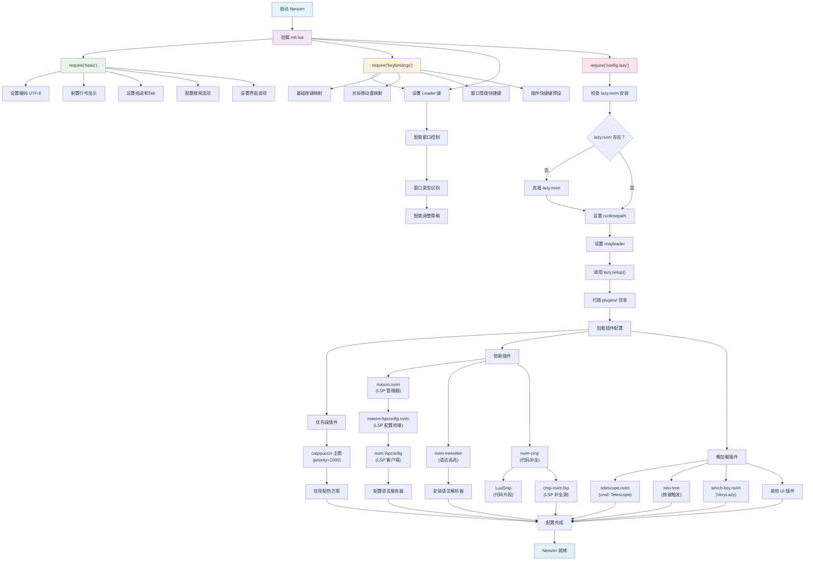

# Neovim Configuration

一个基于 Lua 的现代化 Neovim 配置，使用 lazy.nvim 作为插件管理器。

本配置为**独立 Git 仓库**，可直接克隆使用。支持 macOS、Linux、Windows 及 WSL。

## 项目结构

```
~/.config/nvim/  (或 $XDG_CONFIG_HOME/nvim/)
├── .gitignore                          # Git 忽略文件
├── .idea/                              # JetBrains IDE 项目配置（可选）
│   ├── .gitignore
│   ├── modules.xml
│   ├── nvim.iml
│   └── vcs.xml
├── README.md                           # 项目说明文档
├── install.sh                          # 安装脚本（包含健康检查修复功能）
├── init.lua                            # Neovim 主配置入口
├── lua/                                # Lua 配置文件目录
│   ├── basic.lua                       # 基础设置配置
│   ├── config/                         # 配置模块
│   │   └── lazy.lua                    # lazy.nvim 插件管理器配置
│   ├── keybindings.lua                 # 按键绑定配置
│   ├── window_control.lua              # 智能窗口控制模块
│   └── plugins/                        # 插件配置目录
│       ├── code_completion_nvim-autopairs.lua    # 自动括号配对
│       ├── code_completion_nvim-cmp.lua           # 代码补全
│       ├── code_git_decorations_gitsigns.lua     # Git 装饰
│       ├── code_highlight_nvim-treesitter.lua    # 语法高亮
│       ├── code_snip_LuaSnip.lua                  # 代码片段
│       ├── colorscheme_catppuccin.lua            # 主题配色
│       ├── comment.lua                            # 代码注释
│       ├── dap_lua_one-small-step-for-vimkind.lua # Lua 调试适配器
│       ├── dap_nvim-dap.lua                       # 调试适配器协议
│       ├── finder_telescope.lua                   # 模糊查找
│       ├── greeter_dashboard_mini-starter.lua     # 启动页面
│       ├── help_document_lazydev.lua              # Neovim 开发帮助
│       ├── indent_guides_indent-blankline.lua     # 缩进指示线
│       ├── keytips_which-key.lua                  # 按键提示
│       ├── lsp_server_manager_mason-lspconfig.lua # LSP 服务器配置
│       ├── lsp_server_manager_mason.lua           # LSP 服务器管理
│       ├── lsp_server_nvim-lspconfig.lua          # LSP 配置
│       ├── practice_typr.lua                      # 打字练习
│       ├── ui_buffer_tabpage_bufferline.lua       # 缓冲区标签页
│       ├── ui_component_lib_nui.lua               # UI 组件库
│       ├── ui_dressing.lua                        # UI 界面美化
│       ├── ui_icons_nvim-web-devicons.lua         # 文件图标
│       ├── ui_notice.lua                          # 通知系统
│       ├── ui_outline.lua                         # 代码大纲 (Outline)
│       └── ui_status_line_lualine.lua             # 状态栏
├── scripts/                           # 脚本（install 用 common.sh；Windows 下 bash.cmd 可启动 Git Bash，路径需自行修改）
└── test_dir/                           # 测试目录（测试用，部署时可不复制）
    ├── test.c
    ├── test.cpp
    ├── test.lua
    └── test.py
```

## 启动流程

以下是 Neovim 配置的启动流程图，展示了各个模块的加载顺序和依赖关系：



### 启动阶段说明

1. **初始化阶段**: 加载核心配置文件
   - `init.lua` 作为入口点
   - 按顺序加载基础设置、按键绑定和插件管理器

2. **基础配置阶段**: 设置 Neovim 基本行为
   - 编码和界面设置
   - 编辑器行为配置
   - 搜索和导航选项

3. **按键绑定阶段**: 配置快捷键
   - 设置 Leader 键
   - 重映射基础操作
   - 预设插件快捷键

4. **插件管理器初始化**: 准备插件环境
   - 检查并安装 lazy.nvim
   - 设置插件加载路径
   - 扫描插件配置

5. **插件加载阶段**: 按优先级和依赖关系加载
   - **优先级插件**: 主题等需要早期加载的插件
   - **依赖插件**: LSP、语法高亮、代码补全等核心功能
   - **懒加载插件**: 按需加载的 UI 和工具插件

6. **完成阶段**: 所有配置就绪，Neovim 可以正常使用

## 核心模块说明

### 基础配置

- **init.lua**: Neovim 配置入口文件，加载基础设置、按键绑定和插件管理器
- **lua/basic.lua**: 基础编辑器设置，包括编码、行号、缩进、搜索等配置
- **lua/keybindings.lua**: 自定义按键绑定，包括光标移动、窗口管理、文件操作等
- **lua/window_control.lua**: 智能窗口控制模块，提供窗口类型识别和智能调整策略
- **lua/config/lazy.lua**: lazy.nvim 插件管理器的配置和初始化

### 插件配置

#### 代码编辑增强

##### nvim-cmp (code_completion_nvim-cmp.lua)
**功能**: 智能代码补全系统，支持多种补全源
**快捷键**:
- `Tab` - 选择下一个补全项或展开代码片段
- `Shift+Tab` - 选择上一个补全项
- `Ctrl+Space` - 手动触发补全
- `Enter` - 确认选择
- `Ctrl+e` - 关闭补全菜单

##### nvim-autopairs (code_completion_nvim-autopairs.lua)
**功能**: 自动括号、引号配对，智能处理各种配对字符
**特性**: 自动在输入左括号时添加右括号，支持多种文件类型的智能配对

##### LuaSnip (code_snip_LuaSnip.lua)
**功能**: 代码片段引擎，提供快速代码模板插入
**快捷键**: 与 nvim-cmp 集成，通过 Tab 键展开和跳转

##### Comment.nvim (comment.lua)
**功能**: 智能代码注释插件，支持多种注释格式
**快捷键**:
- `gcc` - 切换当前行注释
- `gbc` - 切换当前行块注释
- `gc` + 动作 - 注释指定范围（如 `gcap` 注释段落）
- `gb` + 动作 - 块注释指定范围
- `gcO` - 在上方添加注释
- `gco` - 在下方添加注释
- `gcA` - 在行尾添加注释

##### nvim-treesitter (code_highlight_nvim-treesitter.lua)
**功能**: 基于 Tree-sitter 的语法高亮和代码解析
**快捷键**:
- `Ctrl+Space` - 初始化选择
- `Ctrl+Space` - 扩展选择到下一个节点
- `Backspace` - 缩小选择范围
**特性**: 支持增量选择、智能缩进、语法感知的文本对象
**诊断命令**: `:TSCheckCompiler` 和 `:TSViewLogs` 可用

##### opencode.nvim (code_ai_opencode.lua)
**功能**: 集成 opencode AI 助手到 Neovim，提供编辑器感知的研究、审查和请求功能
**特性**:
- 自动连接到 CWD 中运行的 opencode 实例
- 共享编辑器上下文（缓冲区、光标、选择、诊断等）
- 支持输入提示、补全和高亮
- 从提示库中选择提示或定义自定义提示
- 执行命令和响应权限请求
- 实时重载编辑后的缓冲区
- 通过状态栏组件监控状态
- 支持范围和点重复（Vim 风格）

**主要功能快捷键**:
- `<leader>aia` - 询问 opencode（当前选择或光标位置）
- `<leader>ais` - 选择 opencode 操作（提示、命令等）
- `<leader>ait` - 切换 opencode 窗口显示/隐藏

**操作符模式**（支持范围和点重复）:
- `go` - 添加范围到 opencode（作为操作符使用，如 `goap` 添加段落）
- `goo` - 添加当前行到 opencode

**会话控制**:
- `<leader>aiu` - 向上滚动 opencode 会话（半页）
- `<leader>aid` - 向下滚动 opencode 会话（半页）
- `<leader>aii` - 中断 opencode 会话

**窗口导航**:
- `<leader>aie` - 从 opencode 窗口返回主编辑窗口（不隐藏 opencode 窗口，仅切换焦点）
- `<leader>j` / `<leader>l` - 在窗口间移动（左侧/右侧）

**上下文占位符**:
opencode.nvim 支持以下上下文占位符，可在提示中使用：
- `@this` - 操作符范围或视觉选择（如果有），否则为光标位置
- `@buffer` - 当前缓冲区
- `@buffers` - 打开的缓冲区
- `@visible` - 可见文本
- `@diagnostics` - 当前缓冲区诊断
- `@quickfix` - Quickfix 列表
- `@diff` - Git diff
- `@marks` - 全局标记
- `@grapple` - grapple.nvim 标签

**内置提示**:
- `diagnostics` - 解释诊断信息
- `diff` - 审查 Git diff
- `document` - 为代码添加注释
- `explain` - 解释代码及其上下文
- `fix` - 修复诊断问题
- `implement` - 实现代码
- `optimize` - 优化代码性能和可读性
- `review` - 审查代码正确性和可读性
- `test` - 为代码添加测试

**配置说明**:
- 使用 `snacks` provider 作为默认提供者（更稳定）
- 自动检测 CWD 中已运行的 opencode 实例
- 如果找不到已存在的实例，会自动启动新的实例
- 支持自动重载编辑后的文件（需要 `autoread` 选项）

**状态栏集成**:
opencode 状态显示在 lualine 状态栏的右侧，显示当前 opencode 会话状态。

**更多信息**: [opencode.nvim GitHub](https://github.com/NickvanDyke/opencode.nvim)

#### LSP 和开发工具

##### nvim-lspconfig (lsp_server_nvim-lspconfig.lua)
**功能**: LSP 客户端配置，提供语言服务器支持
**快捷键**: 通过 LSP 提供的功能（定义跳转、引用查找等）
**支持语言**: Lua, Python, Rust, TypeScript, JavaScript, JSON, YAML 等

##### Mason (lsp_server_manager_mason.lua)
**功能**: LSP 服务器包管理器，便携式工具安装
**快捷键**:
- `<leader>cm` - 打开 Mason 包管理器
- `<leader>cM` - 更新 Mason 注册表
**Mason UI 快捷键**:
- `i` - 安装包
- `u` - 更新包
- `X` - 卸载包
- `Enter` - 展开包详情

##### mason-lspconfig (lsp_server_manager_mason-lspconfig.lua)
**功能**: Mason 和 LSP 配置的桥接，自动安装和配置 LSP 服务器

##### lazydev.nvim (help_document_lazydev.lua)
**功能**: Neovim Lua API 开发支持，提供完整的类型定义和补全
**特性**: 替代 neodev.nvim，支持 Neovim >= 0.10

##### none-ls (lsp_server_null-ls.lua)
**功能**: 使用 Neovim 作为语言服务器，注入 LSP 诊断和代码格式化
**支持工具**: stylua (Lua 格式化), black (Python 格式化)

#### 调试工具

##### nvim-dap (dap_nvim-dap.lua)
**功能**: 调试适配器协议支持，提供完整的调试功能
**快捷键**: 通过调试适配器提供断点、单步执行等功能

##### one-small-step-for-vimkind (dap_lua_one-small-step-for-vimkind.lua)
**功能**: Lua 脚本调试，专门用于调试 Neovim 插件
**快捷键**:
- `<leader>daL` - 启动 Lua 调试服务器
- `<leader>dal` - 调试当前 Lua 文件

#### 用户界面

##### lualine.nvim (ui_status_line_lualine.lua)
**功能**: 现代化状态栏，显示模式、分支、诊断等信息
**显示内容**: 编辑模式、Git 分支、文件差异、LSP 诊断、文件信息、光标位置

##### bufferline.nvim (ui_buffer_tabpage_bufferline.lua)
**功能**: 缓冲区标签页，提供类似现代编辑器的标签体验
**快捷键**:
- `<leader>[` / `[b` - 上一个缓冲区
- `<leader>]` / `]b` - 下一个缓冲区
- `<leader>bp` - 固定缓冲区
- `<leader>bP` - 删除非固定缓冲区
- `<leader>bo` - 删除其他缓冲区
- `<leader>br` - 删除右侧缓冲区
- `<leader>bl` - 删除左侧缓冲区
- `<leader>b` - 关闭当前缓冲区
- **鼠标右键点击** - 关闭对应的缓冲区
- **点击关闭图标** - 关闭对应的缓冲区（如果显示）


##### neo-tree (ui_file_explorer_neo-tree.lua)
**功能**: 现代化文件浏览器，支持文件系统、缓冲区、Git 状态浏览
**快捷键**:
- `<leader>fe` / `<leader>e` - 文件浏览器（根目录）
- `<leader>fE` / `<leader>E` - 文件浏览器（当前文件目录）
- `<leader>be` - 缓冲区浏览器
- `<leader>ge` - Git 状态浏览器

##### nvim-web-devicons (ui_icons_nvim-web-devicons.lua)
**功能**: 文件类型图标，为文件和目录提供美观的图标显示
**特性**: 支持多种文件类型的图标识别

##### dressing.nvim (ui_dressing.lua)
**功能**: 改进默认 UI 界面，提供更美观的选择和输入界面
**特性**: 美化 vim.ui.select 和 vim.ui.input 界面

##### noice.nvim (ui_notice.lua)
**功能**: 消息、命令行和弹出菜单的现代化替换
**特性**: 完全替换 Neovim 的默认 UI 组件

##### nui.nvim (ui_component_lib_nui.lua)
**功能**: UI 组件库，为其他插件提供 UI 组件支持

##### outline.nvim (ui_outline.lua)
**功能**: 代码大纲侧边栏，支持 LSP 和 Tree-sitter 符号导航
**特性**: 
- 支持 LSP 和 Tree-sitter 符号解析
- 智能缓冲区管理，防止缓冲区冲突
- 自动更新符号列表和当前符号高亮
- 支持多种编程语言的符号解析
- 符号层次结构 UI，支持可折叠节点
- 自定义符号图标和映射
- 预览符号位置功能
- 激进缓冲区清理策略，彻底解决冲突问题

**快捷键**:
- `<leader>o` - 切换代码大纲
- `<leader>O` - 强制重新打开代码大纲

**大纲窗口内快捷键**:
- `Enter` - 跳转到符号位置
- `o` - 预览符号位置
- `Ctrl+p` - 切换预览窗口
- `za` - 折叠/展开节点
- `zM` - 折叠所有节点
- `zR` - 展开所有节点
- `Space` - 选择符号
- `j/k` - 上下导航
- `gg/G` - 跳转到第一个/最后一个符号
- `/` - 搜索符号
- `R` - 刷新
- `q` - 关闭
- `?` - 显示帮助

**窗口配置**:
- 固定宽度：30 字符
- 位置：右侧
- 支持智能窗口调整

##### nvim-notify (ui_notification_manager_nvim-notify.lua)
**功能**: 通知管理器，提供美观的通知显示
**快捷键**:
- `<leader>un` - 关闭所有通知

#### 导航和查找

##### telescope.nvim (finder_telescope.lua)
**功能**: 模糊查找器，支持文件、内容、符号等多种搜索
**快捷键**:
- `<leader>ff` - 查找文件
- `<leader>fg` - 实时搜索文本
- `<leader>fb` - 缓冲区列表
- `<leader>fh` - 帮助标签
- `<leader>fr` - 最近文件
- `<leader>fc` - 命令列表
- `<leader>fk` - 键位映射
- `<leader>fs` - 搜索当前单词
- `<leader>fd` - 诊断信息
- `<leader>ft` - Treesitter 符号
- `<leader>fz` - 当前缓冲区模糊搜索
- `<leader>rs` - 恢复上次搜索

**Git 相关搜索**:
- `<leader>gf` - Git 文件
- `<leader>gc` - Git 提交
- `<leader>gb` - Git 分支
- `<leader>gs` - Git 状态

**LSP 相关搜索**:
- `<leader>lr` - LSP 引用
- `<leader>ld` - LSP 定义
- `<leader>li` - LSP 实现
- `<leader>ls` - 文档符号
- `<leader>lw` - 工作区符号

##### which-key.nvim (keytips_which-key.lua)
**功能**: 按键绑定提示，显示可用的快捷键组合
**特性**: 在按下 Leader 键后显示可用的快捷键选项

##### nvim-spectre (search_and_replace_nvim-spectre.lua)
**功能**: 强大的搜索和替换工具，支持正则表达式和多文件操作
**快捷键**:
- `<leader>sr` - 打开替换面板
- `<leader>sw` - 搜索当前单词
- `<leader>sp` - 在当前文件中搜索

#### 会话管理

##### persistence.nvim (session_manager_persistence.lua)
**功能**: 自动保存和恢复编辑会话，支持多项目会话管理
**特性**:
- 自动保存会话：退出时自动保存当前工作环境
- 自动恢复会话：启动时自动恢复上次的工作环境
- 多项目支持：为不同项目保存独立的会话
- 文件浏览器集成：恢复会话后自动打开neo-tree文件浏览器
- 智能会话管理：避免与手动会话操作冲突

**快捷键**:
- `<leader>qs` - 保存会话
- `<leader>ql` - 加载会话
- `<leader>qL` - 加载最后一个会话
- `<leader>qd` - 停止会话记录
- `<leader>Q` - 直接退出 Neovim（保存所有文件）

**自动行为**:
- 启动Neovim时，如果没有命令行参数，会自动恢复上次的会话
- 退出Neovim时，会自动保存当前会话
- 会话恢复后会自动打开文件浏览器，方便继续工作
- 延迟加载机制，确保会话恢复的稳定性

#### 任务运行

##### overseer.nvim (task_runner_overseer.lua)
**功能**: 任务运行与管理，统一控制构建、脚本与命令输出
**特性**:
- 默认通过 ToggleTerm 输出，融入既有终端工作流
- 底部任务列表快速查看状态与详情
- 自定义 “Run current file” 模板，依据文件类型自动挑选解释器
**快捷键**:
- `<leader>or` - 打开任务选择器（`:OverseerRun`）
- `<leader>oo` - 切换任务列表（`:OverseerToggle`）
- `<leader>oa` - 任务快速操作（`:OverseerQuickAction`）
- `<leader>of` - 运行当前文件模板（`:OverseerRunCurrent`）

#### 打字练习

##### typr (practice_typr.lua)
**功能**: 美观的打字练习插件，提供打字练习界面和统计仪表板
**特性**:
- 美观的打字练习界面
- 实时打字统计和进度显示
- 打字历史记录和数据分析
- 支持符号、数字、随机模式切换
- 可自定义练习行数
**命令**:
- `:Typr` - 启动打字练习
- `:TyprStats` - 查看打字统计
**Typr 窗口内快捷键**:
- `s` - 切换符号模式
- `n` - 切换数字模式
- `r` - 切换随机模式
- `3` - 设置 3 行练习（其他数字类似，如 `5` 设置 5 行）
**TyprStats 窗口内快捷键**:
- `D` - 切换到仪表板视图
- `H` - 切换到历史记录视图
- `K` - 切换到按键统计视图
**注意**: 
- typr 缓冲区的文件类型为 `typr`，如需禁用代码补全，请参考补全插件的文档配置该文件类型
- Activity UI 功能仍在开发中，可能无法正常工作

#### 习惯培养

##### hardtime.nvim (practice_hardtime.lua)
**功能**: 帮助培养良好的 Vim 操作习惯，阻止重复按键并提供高效操作提示
**特性**:
- 阻止短时间内重复按键（默认 1 秒内超过 3 次）
- 提供智能提示，建议使用更高效的 Vim 操作方式
- 生成使用习惯报告，帮助识别和改进操作模式
- 针对 ikjl 键位布局进行优化配置
- 禁用方向键和鼠标，强制使用 Vim 原生操作

**命令**:
- `:Hardtime enable` - 启用 Hardtime
- `:Hardtime disable` - 禁用 Hardtime
- `:Hardtime toggle` - 切换 Hardtime 状态
- `:Hardtime report` - 查看使用习惯报告

**配置说明**:
- 默认状态：启用
- 限制按键：`ikjl`（针对当前键位布局）
- 禁用按键：方向键（`<Up>` `<Down>` `<Left>` `<Right>`）
- 限制模式：阻止重复按键（`restriction_mode = "block"`）
- 日志文件：`~/.local/state/nvim/hardtime.nvim.log`

**注意**:
- 本配置针对 `ikjl` 键位布局进行了优化（i=上，k=下，j=左，l=右）
- 如需临时禁用，可使用 `:Hardtime disable` 命令
- 提示消息会显示在命令行区域，建议将 `cmdheight` 设置为 2 或使用状态栏显示模式

##### 推荐的 Vim 高效操作方式

Hardtime 插件推荐的 workflow 本质上是 Vim 设计的核心高效操作方式，掌握这些技巧可以显著提升编辑效率：

**1. 使用相对跳转进行屏幕内垂直移动**

- **传统习惯**：连续按 `j`/`k`（或 `k`/`i`）逐行移动，效率低且容易导致手指疲劳
- **推荐方式**：使用数字前缀直接跳转指定行数，如 `5k`（向下跳 5 行）、`12i`（向上跳 12 行）
- **优势**：减少按键次数，精准定位目标位置，避免重复按键带来的疲劳

**2. 使用 CTRL-U/CTRL-D/gg/G 进行屏幕外垂直移动**

- **传统习惯**：依赖 `j`/`k`（或 `k`/`i`）滚动长文件，耗时且缺乏全局视野
- **推荐方式**：
  - `CTRL-D` 向下翻半屏，`CTRL-U` 向上翻半屏
  - `CTRL-F` 向下翻一屏，`CTRL-B` 向上翻一屏
  - `gg` 跳至文件开头，`G` 跳至文件结尾
- **优势**：适合长距离快速定位，提供文件全局视图，大幅减少滚动时间

**3. 使用单词运动进行短距离水平移动**

- **传统习惯**：用 `h`/`l`（或 `j`/`l`）逐字符移动，尤其在长行中效率极低
- **推荐方式**：
  - `w`/`W` 跳至下一词首（`w` 按单词，`W` 按空白分隔）
  - `b`/`B` 跳至上一词首
  - `e`/`E` 跳至词尾
  - `ge`/`gE` 跳至上一词尾
- **优势**：按"单词"为单位移动，减少按键次数，在代码编辑中特别高效

**4. 使用 f/t/0/$ 等进行中长距离水平移动**

- **传统习惯**：长距离仍依赖 `h`/`l` 或鼠标点击
- **推荐方式**：
  - `f{char}` 跳至该行第一个指定字符，`F{char}` 反向查找
  - `t{char}` 跳至指定字符前，`T{char}` 反向查找
  - `;` 重复上次 f/t 操作，`,` 反向重复
  - `0` 跳至行首，`^` 跳至行首非空白字符，`$` 跳至行尾
- **优势**：直接定位目标字符，定位精准且高效，特别适合代码编辑中的括号、引号等符号定位

**5. 优先使用"操作符 + 运动/文本对象"组合**

- **传统习惯**：先用光标选中内容，再执行删除/修改（如 `v...d`），需要多步操作
- **推荐方式**：
  - `ci{` 清除括号内内容并进入插入模式
  - `dap` 删除整个段落
  - `y5k` 复制向下 5 行
  - `caw` 修改当前单词
- **优势**：直接组合操作，减少操作步骤，符合 Vim "操作 + 范围"的设计哲学，一次按键完成多步操作

**6. 使用 % 和括号命令跳转括号**

- **传统习惯**：手动查找匹配括号，尤其在嵌套结构中容易出错
- **推荐方式**：
  - `%` 在成对括号间跳转（`()` `[]` `{}`）
  - `[(` 跳至上一层 `(`，`])` 跳至下一层 `)`
  - `[{` 跳至上一层 `{`，`]}` 跳至下一层 `}`
- **优势**：快速在匹配括号间跳转，适合代码编辑场景，特别是在处理嵌套结构时非常高效

#### 视觉增强

##### catppuccin.nvim (colorscheme_catppuccin.lua)
**功能**: Catppuccin 主题配色，提供柔和的粉彩主题
**特性**: 支持透明背景、多种样式（latte、frappe、macchiato、mocha）

##### indent-blankline.nvim (indent_guides_indent-blankline.lua)
**功能**: 缩进指示线，显示代码缩进层级
**特性**: 支持作用域高亮、智能缩进检测

##### gitsigns.nvim (code_git_decorations_gitsigns.lua)
**功能**: Git 状态装饰，在编辑器中显示 Git 变更信息
**快捷键**:
- `]h` - 下一个 Git 变更（在 diff 模式下使用 `]c`）
- `[h` - 上一个 Git 变更（在 diff 模式下使用 `[c`）
- `<leader>ghs` - 暂存当前 hunk
- `<leader>ghr` - 重置当前 hunk
- `<leader>ghS` - 暂存整个缓冲区
- `<leader>ghu` - 撤销暂存 hunk
- `<leader>ghR` - 重置整个缓冲区
- `<leader>ghp` - 预览 hunk
- `<leader>ghi` - 内联预览 hunk
- `<leader>ghb` - 显示当前行 blame
- `<leader>ghtb` - 切换当前行 blame 显示
- `<leader>ghB` - 显示文件 blame
- `<leader>ghd` - Diff 当前文件
- `<leader>ghD` - Diff 当前文件 (HEAD~1)
- `<leader>ghts` - 切换标识显示
- `<leader>ghtn` - 切换行号高亮
- `<leader>ghtl` - 切换行高亮
- `<leader>ghtw` - 切换单词 Diff
- `<leader>ghtd` - 切换已删除行显示
- `<leader>ghq` - 所有 Hunks 到 Quickfix
- `<leader>ghl` - 当前缓冲区 Hunks 到 Location List

##### mini.starter (greeter_dashboard_mini-starter.lua)
**功能**: 启动欢迎页面，提供快速访问常用功能的入口
**启动项**:
- `f` - 查找文件
- `n` - 新建文件
- `r` - 最近文件
- `g` - 文本搜索
- `c` - 配置文件
- `s` - 恢复会话
- `S` - 恢复最后一个会话
- `l` - Lazy 插件管理
- `q` - 退出

## 安装和使用

### Neovim 配置路径说明

**重要提示**：Neovim 0.10+ 版本强化了对 XDG 目录规范的支持，优先使用 XDG 风格的路径，以实现跨平台配置路径的统一性。

#### 路径查找优先级

当 Neovim 寻找配置文件（`init.lua` 或 `init.vim`）时，它会按以下顺序查找：

1. **`$XDG_CONFIG_HOME/nvim`**（如果设置了该环境变量）
2. **`$HOME/.config/nvim`**（XDG 风格的新路径，**优先使用**）
3. **`$HOME/AppData/Local/nvim`**（Windows 传统路径，仅在 XDG 路径不存在时使用）

**本项目使用新路径（XDG 风格）**，确保在 Linux、macOS 和 Windows 上的配置路径保持一致。

#### 查看当前配置路径

在 Neovim 中，可以使用以下命令查看当前实际使用的配置路径：

```vim
:echo stdpath('config')
```

这个命令会显示 Neovim 当前使用的配置目录路径。根据路径查找优先级，它会显示：
- 如果设置了 `$XDG_CONFIG_HOME`，则显示 `$XDG_CONFIG_HOME/nvim`
- 否则显示 `$HOME/.config/nvim`（如果存在）
- 或者显示 `$HOME/AppData/Local/nvim`（Windows 传统路径）

查看所有相关的路径，可以使用：
```vim
:echo stdpath('data') " 数据目录
:echo stdpath('config') " 配置目录
:echo stdpath('cache') " 缓存目录
```

**其他有用的路径查询命令**：
- `:echo stdpath('data')` - 查看数据目录（插件、swap 等）
- `:echo stdpath('state')` - 查看状态目录（shada、日志等）
- `:echo stdpath('cache')` - 查看缓存目录
- `:echo stdpath('config')` - 查看配置目录（配置文件所在位置）

#### 各平台路径对照表

| 内容 | 旧路径 (AppData) | 新路径 (XDG 风格) | 说明 |
|------|-----------------|-------------------|------|
| **配置文件** | `%LOCALAPPDATA%\nvim`<br/>`C:\Users\<用户名>\AppData\Local\nvim` | `$XDG_CONFIG_HOME/nvim`<br/>`C:\Users\<用户名>\.config\nvim` | `init.lua` / `init.vim` 所在目录 |
| **数据文件** | `%LOCALAPPDATA%\nvim-data`<br/>`C:\Users\<用户名>\AppData\Local\nvim-data` | `$XDG_DATA_HOME/nvim`<br/>`C:\Users\<用户名>\.local\share\nvim` | 插件、swap、shada 等 |

#### 各平台默认路径

| 平台 | 配置目录 | 数据目录 | 备注 |
|------|----------|----------|------|
| **Linux / *BSD / WSL** | `$HOME/.config/nvim` | `$HOME/.local/share/nvim` | 遵循 XDG 规范 |
| **macOS** | `$HOME/.config/nvim` | `$HOME/.local/share/nvim` | 遵循 XDG 规范 |
| **Windows** | `$HOME/.config/nvim`<br/>（需设置 `XDG_CONFIG_HOME`） | `$HOME/.local/share/nvim`<br/>（需设置 `XDG_DATA_HOME`） | 推荐使用 XDG 风格路径 |
| **Windows (传统)** | `%LOCALAPPDATA%\nvim` | `%LOCALAPPDATA%\nvim-data` | 仅在 XDG 路径不存在时使用 |

### 前置要求

- Neovim >= 0.8.0 (需要 LuaJIT 支持)
- **推荐使用 Neovim 0.10+** 以获得完整的 XDG 目录规范支持
- Git >= 2.19.0
- [Nerd Font](https://www.nerdfonts.com/) 字体 (可选，用于图标显示)
- C 编译器 (用于 nvim-treesitter)
- **安装脚本依赖**：安装脚本需要 [uv](https://github.com/astral-sh/uv)（Python 环境）和 [fnm](https://github.com/Schniz/fnm)（Node.js 环境）。若未安装：
  - **macOS**: `brew install uv fnm`
  - **Linux**: 见 [uv 安装](https://github.com/astral-sh/uv#installation)、[fnm 安装](https://github.com/Schniz/fnm#installation)
  - **WSL**：与 Linux 相同，使用 `$HOME/.config/nvim` 与 `$HOME/.local/share/nvim`，无需额外配置（在 WSL 内安装 Neovim 时）。

### 安装步骤

#### 1. 安装 Neovim

##### macOS (Homebrew)

```bash
brew install neovim
```

##### Linux (Arch Linux)

```bash
sudo pacman -S neovim
```

##### Linux (Ubuntu/Debian)

```bash
sudo apt-get install neovim
```

##### Windows

下载安装包：https://github.com/neovim/neovim/releases

#### 2. 安装配置文件

##### 自动安装（推荐）

使用安装脚本自动检测系统并安装对应配置（包含自动备份）：

```bash
git clone <本仓库 URL> <目标目录>
cd <目标目录>
chmod +x install.sh
./install.sh
```

安装脚本会自动：
- 检查配置完整性（init.lua / lua/）
- 检测操作系统（macOS/Linux/Windows/WSL）
- 备份现有配置文件（如果存在）
- 复制配置文件到 XDG 风格的路径：
  - Linux/macOS/WSL: `~/.config/nvim/`
  - Windows: `%XDG_CONFIG_HOME%/nvim/` 或 `~/.config/nvim/`（如果设置了 XDG_CONFIG_HOME）
- Windows 上检查并提示配置 XDG_CONFIG_HOME 环境变量

##### 手动安装

```bash
# 克隆本仓库后进入仓库根目录
cd <本仓库根目录>

# 备份现有配置
mv ~/.config/nvim{,.bak} 2>/dev/null || true
mv ~/.local/share/nvim{,.bak} 2>/dev/null || true
mv ~/.local/state/nvim{,.bak} 2>/dev/null || true
mv ~/.cache/nvim{,.bak} 2>/dev/null || true

# 复制配置文件（排除 .git 目录）
cp -r ./* ~/.config/nvim/
```

#### 3. 启动 Neovim

```bash
nvim
```

首次启动时，lazy.nvim 会自动安装所有插件。

### 会话管理使用

配置支持自动会话管理，提供以下功能：

1. **自动恢复会话**：
   ```bash
   # 直接启动，会自动恢复上次的会话
   nvim
   ```

2. **手动恢复会话**：
   - 启动页面中按 `s` 恢复会话
   - 启动页面中按 `S` 恢复最后一个会话
   - 使用快捷键 `<leader>ql` 或 `<leader>qL`

3. **指定文件启动**：
   ```bash
   # 指定文件或目录启动，不会自动恢复会话
   nvim some_file.txt
   nvim /path/to/project
   ```

4. **会话管理**：
   - `<leader>qs` - 手动保存当前会话
   - `<leader>qd` - 停止自动会话记录

## 快捷键说明

### 基础操作
- `<Space>` - Leader 键
- `S` - 保存文件
- `Q` - 退出
- `:e!` - 强制（!）重新编辑（e）当前文件，直接覆盖 Neovim 缓冲区里的旧内容，加载外部修改后的最新版本
- `<leader>Q` - 直接退出Neovim（保存所有文件）
- `R` - 重载配置
- `<leader>rc` - 打开配置文件

### 光标移动 (重新映射)
- `i` - 向上移动 (替代 k)
- `k` - 向下移动 (替代 j)
- `j` - 向左移动 (替代 h)
- `l` - 向右移动 (保持不变)
- `I` - 向上移动5行
- `K` - 向下移动5行
- `J` - 移动到行首
- `L` - 移动到行尾
- `<C-u>` - 向上滚动半页
- `<C-d>` - 向下滚动半页

### 编辑模式
- `h` - 进入插入模式 (替代 i)
- `H` - 在行首插入 (替代 I)

### 编辑操作
- `u` - 撤销 (Undo)
- `<C-r>` - 重做 (Redo)

### 窗口管理
- `si` - 向上分屏
- `sk` - 向下分屏
- `sj` - 向左分屏
- `sl` - 向右分屏
- `<leader>i/k/j/l` - 在窗口间移动
- `<leader>q` - 关闭当前窗口
- `<leader>b` - 关闭当前 buffer

#### 智能窗口大小调整
- `<C-Up>/<C-Down>` - 调整窗口高度（步长：3行）
- `<C-Left>/<C-Right>` - 调整窗口宽度（步长：3字符）
- `<leader>wn` - 设置窗口为窄模式
- `<leader>wN` - 设置窗口为正常模式
- `<leader>ww` - 设置窗口为宽模式
- `<leader>wb` - 平衡所有窗口大小
- `<leader>wm` - 最大化当前窗口
- `<leader>wr` - 恢复窗口布局

**智能特性：**
- 插件窗口（outline、neo-tree）有合理的宽度限制
- 大纲窗口：最小30字符，最大35%屏幕宽度，步长限制为-2到2字符
- 文件树窗口：最小35字符，最大45%屏幕宽度，步长限制为-2到2字符
- 智能调整：在主窗口时，Ctrl+←/→会调整相邻的插件窗口而不是主窗口
- 动态范围：根据屏幕宽度自动调整最大宽度限制
- 调试功能：`<leader>wd` 显示当前窗口信息和相邻插件窗口
- 缓冲区管理：自动清理outline插件的残留缓冲区

### 文件和项目
- `<leader>fe` / `<leader>e` - 切换文件浏览器（根目录）
- `<leader>fE` / `<leader>E` - 切换文件浏览器（当前文件目录）
- `<leader>be` - 缓冲区浏览器
- `<leader>ge` - Git状态浏览器
- `<leader>o` - 切换代码大纲
- `<leader>O` - 打开代码大纲
- `<C-j>/<C-l>` - 切换 buffer 标签
- `<leader>/` - 打开终端

### 终端操作

#### 内置终端
| 快捷键 | 功能 |
|--------|------|
| `<leader>/` | 在下方分割窗口并打开终端 |
| `<C-N>` | 退出终端模式（在终端模式下） |
| `<C-O>` | 关闭终端（在终端模式下） |
| `Ctrl + d` | 关闭终端 |

#### ToggleTerm 终端管理

##### 主要快捷键

| 快捷键 | 模式 | 功能 |
|--------|------|------|
| `<leader>/` | 普通模式 | **切换终端**（开启时聚焦到终端，关闭时回到之前窗口） |
| `<leader>/` | 插入模式 | **切换终端**（先退出插入模式再切换终端） |
| `<leader>/` | 终端模式 | **关闭终端并回到之前窗口** |
| `<Ctrl-`>` | 普通模式 | 切换终端（备用快捷键） |

##### 其他终端类型

| 快捷键 | 功能 |
|--------|------|
| `<leader>tf` | 浮动终端 |
| `<leader>th` | 水平终端 |
| `<leader>tv` | 垂直终端（宽度80列） |
| `<leader>ta` | 切换所有终端 |

##### 预定义终端

| 快捷键 | 功能 |
|--------|------|
| `<leader>tg` | Lazygit（浮动窗口） |
| `<leader>tn` | Node REPL（水平分割） |
| `<leader>tp` | Python REPL（水平分割） |
| `<leader>tr` | Htop 系统监控（浮动窗口） |

##### 代码发送

| 快捷键 | 模式 | 功能 |
|--------|------|------|
| `<leader>ts` | 普通模式 | 发送当前行到终端 |
| `<leader>ts` | 可视模式 | 发送选中内容到终端 |

##### 终端模式下的快捷键

| 快捷键 | 功能 |
|--------|------|
| `<leader>/` | **关闭终端并回到之前窗口** |
| `<Esc>` 或 `jk` | 退出终端模式但不关闭终端 |
| `<C-h>` | 移动到左侧窗口 |
| `<C-j>` | 移动到下方窗口 |
| `<C-k>` | 移动到上方窗口 |
| `<C-l>` | 移动到右侧窗口 |
| `<C-w>` | 窗口操作前缀（先退出终端模式） |

##### 使用说明

**工作流程建议**：
1. **开启终端**：在普通模式或插入模式下按 `<leader>/` 开启终端
2. **执行命令**：在终端中执行所需命令
3. **退出终端模式**：按 `<Esc>` 或 `jk` 退出终端模式但保持终端开启
4. **编辑文件**：使用窗口导航快捷键（`<C-h/j/k/l>`）切换到编辑窗口
5. **关闭终端**：在任何模式下按 `<leader>/` 关闭终端并回到之前窗口

**在终端中分割新终端**：

在终端中分割新终端（上下分、左右分）的操作流程：

**在终端模式下操作**
1. 在终端中按 `<Esc>` 或 `jk` 退出终端模式（终端保持打开）
2. 使用窗口分割快捷键：
   - `sk` - 向下分屏（在下方创建新窗口）
   - `si` - 向上分屏（在上方创建新窗口）
   - `sl` - 向右分屏（在右侧创建新窗口）
   - `sj` - 向左分屏（在左侧创建新窗口）
3. 在新窗口中按 `<leader>/` 打开新终端

**实际操作示例**：

*场景：在终端中上下分割新终端*
1. 打开第一个终端：按 `<leader>/`
2. 退出终端模式：按 `<Esc>`
3. 向下分割：按 `sk`
4. 在新窗口打开终端：按 `<leader>/`

*场景：在终端中左右分割新终端*
1. 打开第一个终端：按 `<leader>/`
2. 退出终端模式：按 `<Esc>`
3. 向右分割：按 `sl`
4. 在新窗口打开终端：按 `<leader>/`

**特殊功能**：
- **浮动终端**：适合临时命令执行，不占用编辑空间
- **水平/垂直终端**：适合需要同时查看代码和终端输出的场景
- **预定义终端**：快速启动常用工具（Git、REPL、系统监控等）
- **代码发送**：直接将代码发送到终端执行，适合交互式开发

### Neo-tree 文件浏览器

#### 全局快捷键（在任何地方都可以使用）
##### 文件浏览器启动
- `<leader>fe` - 打开文件浏览器（根目录）
- `<leader>fE` - 打开文件浏览器（当前文件所在目录）
- `<leader>e` - 文件浏览器（根目录）的别名
- `<leader>E` - 文件浏览器（当前文件）的别名
##### 专用浏览器
- `<leader>be` - 打开缓冲区浏览器
- `<leader>ge` - 打开 Git 状态浏览器

#### Neo-tree 窗口内快捷键
##### 基本操作
- `<space>` - 展开/折叠节点
- `<2-LeftMouse>` - 双击打开文件
- `<cr>` (回车) - 打开文件
- `<esc>` - 取消操作
- `q` - 关闭 Neo-tree 窗口
##### 文件预览
- `P` - 切换预览（浮动窗口）
- `l` - 聚焦到预览窗口
##### 文件打开方式
- `S` - 水平分屏打开
- `s` - 垂直分屏打开
- `t` - 新标签页打开
- `w` - 使用窗口选择器打开
##### 节点操作
- `C` - 关闭节点
- `z` - 关闭所有节点
- `Z` - 展开所有节点
##### 文件/文件夹管理
- `a` - 添加文件
- `A` - 添加文件夹
- `d` - 删除文件/文件夹
- `r` - 重命名
- `c` - 复制
- `m` - 移动
##### 剪贴板操作
- `y` - 复制到系统剪贴板
- `x` - 剪切到系统剪贴板
- `p` - 从系统剪贴板粘贴
##### 视图切换
- `<` - 切换到上一个数据源
- `>` - 切换到下一个数据源
- `R` - 刷新
- `?` - 显示帮助
- `gd` - 显示文件详细信息

#### Git 状态浏览器专用快捷键
当使用 `<leader>ge` 打开 Git 状态浏览器时，额外可用：

- `A` - Git 添加所有文件
- `gu` - Git 取消暂存文件
- `ga` - Git 添加文件到暂存区
- `gr` - Git 恢复文件
- `gc` - Git 提交
- `gp` - Git 推送
- `gg` - Git 提交并推送

#### 使用建议
1. **日常文件浏览**：使用 `<leader>e` 快速打开文件浏览器
2. **当前文件目录**：使用 `<leader>E` 在当前文件所在目录打开
3. **缓冲区管理**：使用 `<leader>be` 查看和切换已打开的缓冲区
4. **Git 工作流**：使用 `<leader>ge` 进行 Git 状态管理
5. **快速预览**：使用 `P` 预览文件内容而不打开

### 快速搜索

#### 当前文件搜索

**当前缓冲区模糊搜索：**
- `<leader>fz` - 在当前打开的文件中进行模糊搜索

**搜索当前光标下的单词：**
- `<leader>fs` - 搜索当前光标所在位置的单词

#### 全局搜索

**实时全局搜索（推荐）：**
- `<leader>fg` - 在整个项目中实时搜索文本内容

**查找文件：**
- `<leader>ff` - 按文件名搜索并打开文件

**Git 文件搜索：**
- `<leader>gf` - 在 Git 跟踪的文件中搜索

#### 其他有用的搜索功能

- `<leader>fr` - 搜索最近打开的文件
- `<leader>fb` - 搜索当前打开的缓冲区
- `<leader>fh` - 搜索帮助文档
- `<leader>fc` - 搜索可用命令
- `<leader>fk` - 搜索键位映射
- `<leader>rs` - 恢复上次搜索

#### 搜索操作技巧

在 Telescope 搜索界面中：
- `Ctrl + i` - 上移动选择
- `Ctrl + k` - 下移动选择
- `↑/↓` - 上下移动选择
- `Enter` - 打开选中的文件
- `Ctrl + x` - 在水平分屏中打开
- `Ctrl + v` - 在垂直分屏中打开
- `Ctrl + t` - 在新标签页中打开
- `Esc` - 退出搜索

**最常用的搜索快捷键：**
- `<leader>fz` - 当前文件搜索
- `<leader>fg` - 全局文本搜索
- `<leader>ff` - 文件名搜索

### 搜索和导航
- `n/N` - 下一个/上一个搜索结果
- `<leader><CR>` - 取消搜索高亮
- `*/#` - 搜索当前单词 (向前/向后)

### 会话管理
- `<leader>qs` - 保存当前会话
- `<leader>ql` - 加载会话
- `<leader>qL` - 加载最后一个会话
- `<leader>qd` - 停止会话记录
- `<leader>Q` - 直接退出 Neovim（保存所有文件）

### 任务运行
- `<leader>or` - 运行 Overseer 任务
- `<leader>oo` - 打开/关闭任务列表
- `<leader>oa` - Overseer 快速操作
- `<leader>of` - 运行当前文件 Overseer 模板

### 代码操作
- `<leader>o` - 折叠/展开代码
- `<leader>sc` - 切换字符大小写
- `<Tab>` - 增加缩进 (可视模式)
- `<S-Tab>` - 减少缩进 (可视模式)
- `<` / `>` - 减少/增加缩进并保持选择

### AI 助手 (opencode)

#### 主要功能
- `<leader>aia` - 询问 opencode（当前选择或光标位置）
- `<leader>ais` - 选择 opencode 操作（提示、命令等）
- `<leader>ait` - 切换 opencode 窗口显示/隐藏

#### 操作符模式
- `go` - 添加范围到 opencode（作为操作符使用，如 `goap` 添加段落）
- `goo` - 添加当前行到 opencode

#### 会话控制
- `<leader>aiu` - 向上滚动 opencode 会话（半页）
- `<leader>aid` - 向下滚动 opencode 会话（半页）
- `<leader>aii` - 中断 opencode 会话

#### 窗口导航
- `<leader>aie` - 从 opencode 窗口返回主编辑窗口（不隐藏 opencode 窗口，仅切换焦点）
- `<leader>j` / `<leader>l` - 在窗口间移动（左侧/右侧）

#### 使用技巧
1. **快速询问**：选中代码后按 `<leader>aia` 直接询问
2. **操作符模式**：使用 `go` 作为操作符，支持 Vim 的点和重复功能
3. **上下文占位符**：在提示中使用 `@this`、`@buffer`、`@diagnostics` 等占位符
4. **窗口切换**：在 opencode 窗口中按 `<leader>aie` 快速返回编辑窗口，opencode 窗口保持可见

### LSP 语言服务器

#### 代码导航
- `gD` - 跳转到声明
- `gd` - 跳转到定义
- `gr` - 查找引用
- `gI` - 跳转到实现
- `gy` - 跳转到类型定义

#### 代码信息
- `D` - 悬停文档
- `gK` - 签名帮助
- `<C-k>` - 签名帮助 (插入模式)

#### 代码编辑
- `<leader>cr` - 重命名
- `<leader>ca` - 代码操作
- `<leader>cf` - 格式化代码

#### 诊断信息
- `<leader>cd` - 行诊断
- `]d` - 下一个诊断
- `[d` - 上一个诊断
- `<leader>cq` - 诊断列表

#### 工作区管理
- `<leader>wa` - 添加工作区文件夹
- `<leader>wr` - 移除工作区文件夹
- `<leader>wl` - 列出工作区文件夹

### 复制粘贴
- `<leader>y` - 复制到系统剪贴板
- `<leader>p` - 从系统剪贴板粘贴
- `<leader>P` - 在上方粘贴

### 文本操作
- `<leader>d` - 删除不进入寄存器
- `<leader>c` - 修改不进入寄存器
- `<leader>x` - 剪切不进入寄存器

## 更新配置

在本仓库根目录拉取最新代码后重新运行安装脚本：

```bash
cd <本仓库根目录>
git pull
./install.sh
```

## Windows 配置说明

在 Windows 上使用 Neovim 时，**强烈推荐**配置 XDG 环境变量，以便使用与 Linux/macOS 一致的配置路径。

### 为什么使用 XDG 路径？

1. **统一性**：在 Linux、macOS 和 Windows 上使用相同的配置路径结构
2. **优先级**：Neovim 0.10+ 优先检查 `$HOME/.config/nvim`，如果存在则忽略旧路径
3. **现代化**：遵循 XDG 目录规范，符合现代工具的标准做法

### 配置步骤

#### 1. 设置 XDG_CONFIG_HOME（配置文件目录）

1. **打开系统属性**：
   - 右键单击"此电脑"或"计算机"图标，选择"属性"
   - 在左侧菜单中，点击"高级系统设置"

2. **打开环境变量设置**：
   - 在"系统属性"窗口中，点击"环境变量"按钮

3. **添加新环境变量**：
   - 在"用户变量"部分点击"新建"按钮

4. **输入变量名和变量值**：
   - **变量名**：`XDG_CONFIG_HOME`
   - **变量值**：`C:\Users\<用户名>\.config\`
     例如：`C:\Users\Administrator\.config\`
   - 点击"确定"保存

#### 2. 设置 XDG_DATA_HOME（数据文件目录，可选但推荐）

按照相同步骤添加：

- **变量名**：`XDG_DATA_HOME`
- **变量值**：`C:\Users\<用户名>\.local\share\`
  例如：`C:\Users\Administrator\.local\share\`

#### 3. 确认更改

- 关闭所有窗口，确保更改已保存
- **重新启动终端**：关闭并重新打开 Git Bash 或 PowerShell，以使新环境变量生效

### 验证环境变量

#### 在终端中验证

在 Git Bash 中运行：

```bash
echo $XDG_CONFIG_HOME
echo $XDG_DATA_HOME
```

应该输出：
- `C:\Users\<用户名>\.config\`
- `C:\Users\<用户名>\.local\share\`

#### 在 Neovim 中验证实际使用的路径

启动 Neovim 后，可以使用以下命令查看 Neovim 实际使用的配置路径：

```vim
:echo stdpath('config')
```

这个命令会显示 Neovim 当前实际使用的配置目录。如果配置正确，应该显示：
- `C:\Users\<用户名>\.config\nvim`（如果设置了 `XDG_CONFIG_HOME`）
- 或者 `C:\Users\<用户名>\.config\nvim`（如果 `$HOME/.config/nvim` 目录存在）

**其他有用的路径查询命令**：
```vim
:echo stdpath('data')    " 查看数据目录（插件、swap 等）
:echo stdpath('state')   " 查看状态目录（shada、日志等）
:echo stdpath('cache')   " 查看缓存目录
```

### 配置路径说明

配置完成后，Neovim 的路径将是：

- **配置文件**：`%XDG_CONFIG_HOME%\nvim\` (即 `~/.config/nvim/`)
- **数据文件**：`%XDG_DATA_HOME%\nvim\` (即 `~/.local/share/nvim/`)

**验证方法**：在 Neovim 中运行 `:echo stdpath('config')` 和 `:echo stdpath('data')` 来确认实际使用的路径。

### 注意事项

- 如果 `$HOME/.config/nvim` 目录存在，Neovim 0.10+ 会优先使用它，**忽略**旧的 `AppData\Local\nvim` 路径
- 如果未设置 `XDG_CONFIG_HOME`，Neovim 仍会尝试使用 `$HOME/.config/nvim`（如果存在）
- 建议同时设置 `XDG_CONFIG_HOME` 和 `XDG_DATA_HOME` 以获得完整的 XDG 支持

## 故障排除

### 配置不完整或未在正确目录运行

若提示 "Configuration incomplete" 或找不到 init.lua/lua：请确保在**本仓库根目录**下执行 `./install.sh`，不要在其他路径或未完整克隆的目录中运行。

### 配置文件冲突

如果安装时提示配置文件已存在，安装脚本会自动备份。备份文件位于：
`~/.config/nvim.backup.YYYYMMDD_HHMMSS`

### Windows 上配置文件位置不正确

**问题**：Neovim 找不到配置文件或使用了错误的路径。

**诊断步骤**：

1. **检查 Neovim 实际使用的配置路径**：
   在 Neovim 中运行：
   ```vim
   :echo stdpath('config')
   ```
   这会显示 Neovim 当前实际使用的配置目录路径。

2. **验证环境变量**：
   在 Git Bash 中运行 `echo $XDG_CONFIG_HOME` 应该显示正确的路径（`C:\Users\<用户名>\.config\`）

3. **检查配置文件位置**：
   确认配置文件已复制到 `~/.config/nvim/` 目录（或 `stdpath('config')` 显示的路径）

**解决方案**：
1. 确保已正确设置 `XDG_CONFIG_HOME` 环境变量（指向 `C:\Users\<用户名>\.config\`）
2. 重新启动终端以使环境变量生效
3. 如果 `stdpath('config')` 显示的是旧路径（`AppData\Local\nvim`），检查是否存在 `$HOME/.config/nvim` 目录
4. 如果旧路径存在但新路径不存在，Neovim 可能会使用旧路径。建议：
   - 将配置文件从旧路径迁移到新路径
   - 或者删除旧路径，强制使用新路径

**注意**：Neovim 0.10+ 会优先使用 `$HOME/.config/nvim`，如果该目录存在，会忽略旧的 `AppData\Local\nvim` 路径。使用 `:echo stdpath('config')` 可以确认 Neovim 实际使用的路径。

### 插件安装失败

1. 检查网络连接
2. 确保 Neovim 版本 >= 0.8.0
3. 查看 Neovim 日志：`:messages`

### 健康检查警告和错误

如果 `:checkhealth` 显示警告或错误：

1. **运行安装脚本自动修复**：
   ```bash
   ./install.sh
   ```
   脚本会自动安装缺失的工具和依赖。

2. **手动安装缺失的工具**：
   - Go: `winget install GoLang.Go` (Windows) 或使用系统包管理器
   - Composer: 下载 phar 文件或使用包管理器
   - tree-sitter CLI: `npm install -g tree-sitter-cli`
   - pnpm: `npm install -g pnpm`
   - neovim Ruby gem: `gem install neovim` (如果使用 Ruby)

3. **检查环境变量**：
   - 确保 `APPDATA` 环境变量在 Windows 上正确设置（Git Bash 需要）
   - 确保工具的可执行文件在系统 PATH 中

4. **查看详细日志**：
   保存健康检查日志并查看具体错误信息。

## 健康检查和诊断

Neovim 提供了 `:checkhealth` 命令来检查配置和插件的健康状态。`install.sh` 脚本已集成健康检查修复功能，会自动安装缺失的工具和依赖。

### 运行健康检查

在 Neovim 中执行：
```vim
:checkhealth
```

### 保存健康检查日志

#### 方法一：使用 `:redir` 命令（推荐）

在交互式 nvim 中执行以下命令序列：

```vim
:redir > nvim_checkhealth.log
:checkhealth
:redir END
```

**操作步骤**：
1. 打开 nvim：`nvim`
2. 执行 `:redir > nvim_checkhealth.log` 开始重定向输出
3. 执行 `:checkhealth` 执行健康检查（会显示完整输出）
4. 执行 `:redir END` 结束重定向
5. 退出 nvim：`:q`
6. 查看日志：`cat nvim_checkhealth.log`

**追加模式**（如果需要追加到现有文件）：
```vim
:redir >> nvim_checkhealth.log
:checkhealth
:redir END
```

#### 方法二：非交互式命令（一行命令）

在终端中直接执行：

```bash
nvim --cmd "redir > nvim_checkhealth.log" -c "checkhealth" -c "redir END" -c "q"
```

### 自动修复健康检查问题

`install.sh` 脚本已集成健康检查修复功能，会自动：

1. **安装语言工具**：
   - Go（通过 winget 或包管理器）
   - Composer（下载 phar 文件）
   - Ruby（检查是否已安装）

2. **安装开发工具**：
   - tree-sitter CLI（通过 npm）
   - pnpm（通过 npm）
   - neovim Ruby gem（如果 Ruby 可用）

3. **修复配置问题**：
   - 禁用不需要的 provider（如 Perl）
   - 配置 DAP 适配器路径
   - 确保环境变量正确传递

### 代理支持

如果网络环境需要代理，可以通过环境变量配置：

```bash
export PROXY_HOST=127.0.0.1
export PROXY_PORT=7890
export USE_PROXY=1
./install.sh
```

或禁用代理：
```bash
export USE_PROXY=0
./install.sh
```

## 维护说明

- 插件配置文件按功能分类命名，便于管理和查找
- 每个插件配置文件都包含插件说明、GitHub 链接和配置选项
- 使用 lazy.nvim 的延迟加载特性优化启动速度
- 定期运行 `:Lazy update` 更新插件
- 运行 `:MasonUpdate` 更新 LSP 服务器和工具
- 定期运行 `:checkhealth` 检查配置健康状态

## 参考链接

- [Neovim 官方文档](https://neovim.io/doc/user/index.html)
- [Neovim Lua 学习指南](https://github.com/nshen/learn-neovim-lua)
- [lazy.nvim 文档](https://github.com/folke/lazy.nvim)
- [原始配置仓库](https://github.com/xiaolitongxue666/nvim)

## 原始配置仓库

此配置来自独立的 GitHub 仓库：
- 仓库地址: https://github.com/xiaolitongxue666/nvim
- 详细文档请参考原始仓库的 README.md

