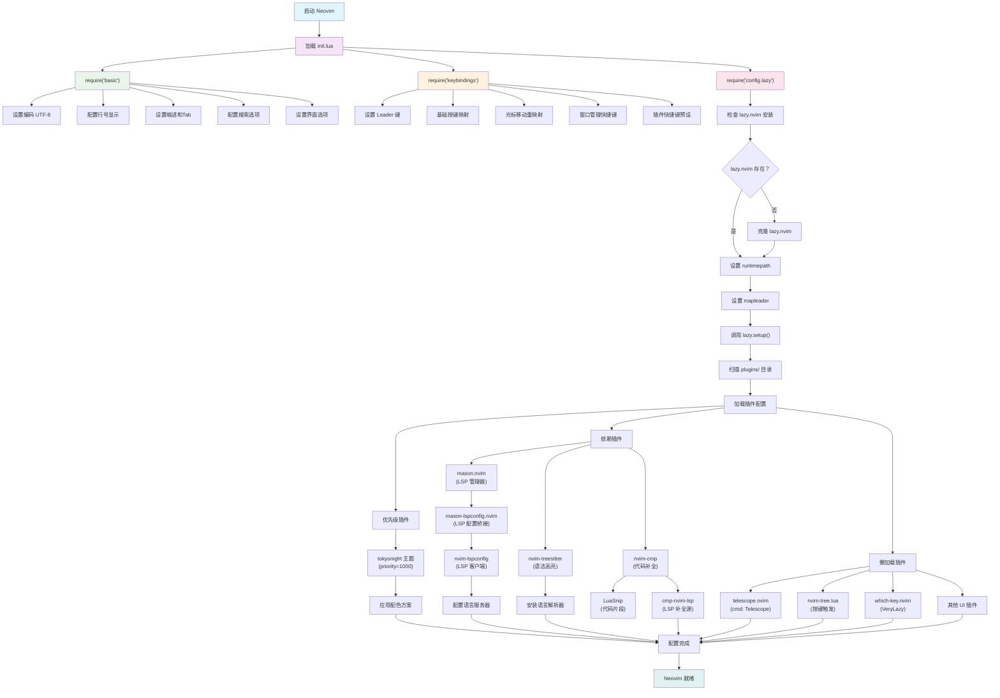

# Neovim Configuration

一个基于 Lua 的现代化 Neovim 配置，使用 lazy.nvim 作为插件管理器。

## 项目结构

```
/Users/liyong/.config/nvim/
├── .gitignore                          # Git 忽略文件
├── .idea/                              # JetBrains IDE 项目配置（可选）
│   ├── .gitignore
│   ├── modules.xml
│   ├── nvim.iml
│   └── vcs.xml
├── Dockerfile                          # Docker 容器配置
├── README.md                           # 项目说明文档
├── init.lua                            # Neovim 主配置入口
├── lua/                                # Lua 配置文件目录
│   ├── basic.lua                       # 基础设置配置
│   ├── config/                         # 配置模块
│   │   └── lazy.lua                    # lazy.nvim 插件管理器配置
│   ├── keybindings.lua                 # 按键绑定配置
│   └── plugins/                        # 插件配置目录
│       ├── code_completion_nvim-autopairs.lua    # 自动括号配对
│       ├── code_completion_nvim-cmp.lua           # 代码补全
│       ├── code_git_decorations_gitsigns.lua     # Git 装饰
│       ├── code_highlight_nvim-treesitter.lua    # 语法高亮
│       ├── code_snip_LuaSnip.lua                  # 代码片段
│       ├── colorscheme_tokyonight.lua             # 主题配色
│       ├── comment.lua                            # 代码注释
│       ├── dap_lua_one-small-step-for-vimkind.lua # Lua 调试适配器
│       ├── dap_nvim-dap.lua                       # 调试适配器协议
│       ├── finder_telescope.lua                   # 模糊查找
│       ├── greeter_dashboard_alpha-nvim.lua       # 启动页面
│       ├── help_document_neodev.lua               # Neovim 开发帮助
│       ├── indent_guides_indent-blankline.lua     # 缩进指示线
│       ├── keytips_which-key.lua                  # 按键提示
│       ├── lsp_server_manager_mason-lspconfig.lua # LSP 服务器配置
│       ├── lsp_server_manager_mason.lua           # LSP 服务器管理
│       ├── lsp_server_nvim-lspconfig.lua          # LSP 配置
│       ├── ui_buffer_tabpage_bufferline.lua       # 缓冲区标签页
│       ├── ui_component_lib_nui.lua               # UI 组件库
│       ├── ui_dressing.lua                        # UI 界面美化
│       ├── ui_icons_nvim-web-devicons.lua         # 文件图标
│       ├── ui_notice.lua                          # 通知系统
│       ├── ui_nvim-tree.lua                       # 文件浏览器
│       └── ui_status_line_lualine.lua             # 状态栏
└── test_dir/                           # 测试目录
    ├── test.c
    ├── test.cpp
    ├── test.lua
    └── test.py
```

## 启动流程

以下是 Neovim 配置的启动流程图，展示了各个模块的加载顺序和依赖关系：



### 启动阶段说明

1. **初始化阶段**: 加载核心配置文件
   - `init.lua` 作为入口点
   - 按顺序加载基础设置、按键绑定和插件管理器

2. **基础配置阶段**: 设置 Neovim 基本行为
   - 编码和界面设置
   - 编辑器行为配置
   - 搜索和导航选项

3. **按键绑定阶段**: 配置快捷键
   - 设置 Leader 键
   - 重映射基础操作
   - 预设插件快捷键

4. **插件管理器初始化**: 准备插件环境
   - 检查并安装 lazy.nvim
   - 设置插件加载路径
   - 扫描插件配置

5. **插件加载阶段**: 按优先级和依赖关系加载
   - **优先级插件**: 主题等需要早期加载的插件
   - **依赖插件**: LSP、语法高亮、代码补全等核心功能
   - **懒加载插件**: 按需加载的 UI 和工具插件

6. **完成阶段**: 所有配置就绪，Neovim 可以正常使用

## 核心模块说明

### 基础配置

- **init.lua**: Neovim 配置入口文件，加载基础设置、按键绑定和插件管理器
- **lua/basic.lua**: 基础编辑器设置，包括编码、行号、缩进、搜索等配置
- **lua/keybindings.lua**: 自定义按键绑定，包括光标移动、窗口管理、文件操作等
- **lua/config/lazy.lua**: lazy.nvim 插件管理器的配置和初始化

### 插件配置

#### 代码编辑增强

##### nvim-cmp (code_completion_nvim-cmp.lua)
**功能**: 智能代码补全系统，支持多种补全源
**快捷键**:
- `Tab` - 选择下一个补全项或展开代码片段
- `Shift+Tab` - 选择上一个补全项
- `Ctrl+Space` - 手动触发补全
- `Enter` - 确认选择
- `Ctrl+e` - 关闭补全菜单

##### nvim-autopairs (code_completion_nvim-autopairs.lua)
**功能**: 自动括号、引号配对，智能处理各种配对字符
**特性**: 自动在输入左括号时添加右括号，支持多种文件类型的智能配对

##### LuaSnip (code_snip_LuaSnip.lua)
**功能**: 代码片段引擎，提供快速代码模板插入
**快捷键**: 与 nvim-cmp 集成，通过 Tab 键展开和跳转

##### Comment.nvim (comment.lua)
**功能**: 智能代码注释插件，支持多种注释格式
**快捷键**:
- `gcc` - 切换当前行注释
- `gbc` - 切换当前行块注释
- `gc` + 动作 - 注释指定范围（如 `gcap` 注释段落）
- `gb` + 动作 - 块注释指定范围
- `gcO` - 在上方添加注释
- `gco` - 在下方添加注释
- `gcA` - 在行尾添加注释

##### nvim-treesitter (code_highlight_nvim-treesitter.lua)
**功能**: 基于 Tree-sitter 的语法高亮和代码解析
**快捷键**:
- `Ctrl+Space` - 初始化选择
- `Ctrl+Space` - 扩展选择到下一个节点
- `Backspace` - 缩小选择范围
**特性**: 支持增量选择、智能缩进、语法感知的文本对象

#### LSP 和开发工具

##### nvim-lspconfig (lsp_server_nvim-lspconfig.lua)
**功能**: LSP 客户端配置，提供语言服务器支持
**快捷键**: 通过 LSP 提供的功能（定义跳转、引用查找等）
**支持语言**: Lua, Python, Rust, TypeScript, JavaScript, JSON, YAML 等

##### Mason (lsp_server_manager_mason.lua)
**功能**: LSP 服务器包管理器，便携式工具安装
**快捷键**:
- `<leader>cm` - 打开 Mason 包管理器
- `<leader>cM` - 更新 Mason 注册表
**Mason UI 快捷键**:
- `i` - 安装包
- `u` - 更新包
- `X` - 卸载包
- `Enter` - 展开包详情

##### mason-lspconfig (lsp_server_manager_mason-lspconfig.lua)
**功能**: Mason 和 LSP 配置的桥接，自动安装和配置 LSP 服务器

##### lazydev.nvim (help_document_lazydev.lua)
**功能**: Neovim Lua API 开发支持，提供完整的类型定义和补全
**特性**: 替代 neodev.nvim，支持 Neovim >= 0.10

##### none-ls (lsp_server_null-ls.lua)
**功能**: 使用 Neovim 作为语言服务器，注入 LSP 诊断和代码格式化
**支持工具**: stylua (Lua 格式化), black (Python 格式化)

#### 调试工具

##### nvim-dap (dap_nvim-dap.lua)
**功能**: 调试适配器协议支持，提供完整的调试功能
**快捷键**: 通过调试适配器提供断点、单步执行等功能

##### one-small-step-for-vimkind (dap_lua_one-small-step-for-vimkind.lua)
**功能**: Lua 脚本调试，专门用于调试 Neovim 插件
**快捷键**:
- `<leader>daL` - 启动 Lua 调试服务器
- `<leader>dal` - 调试当前 Lua 文件

#### 用户界面

##### lualine.nvim (ui_status_line_lualine.lua)
**功能**: 现代化状态栏，显示模式、分支、诊断等信息
**显示内容**: 编辑模式、Git 分支、文件差异、LSP 诊断、文件信息、光标位置

##### bufferline.nvim (ui_buffer_tabpage_bufferline.lua)
**功能**: 缓冲区标签页，提供类似现代编辑器的标签体验
**快捷键**:
- `Shift+h` / `[b` - 上一个缓冲区
- `Shift+l` / `]b` - 下一个缓冲区
- `<leader>bp` - 固定缓冲区
- `<leader>bo` - 删除其他缓冲区
- `<leader>br` - 删除右侧缓冲区
- `<leader>bl` - 删除左侧缓冲区

##### nvim-tree (ui_nvim-tree.lua)
**功能**: 文件浏览器树形视图
**快捷键**:
- `tt` - 切换文件浏览器

##### neo-tree (ui_file_explorer_neo-tree.lua)
**功能**: 现代化文件浏览器，支持文件系统、缓冲区、Git 状态浏览
**快捷键**:
- `<leader>fe` / `<leader>e` - 文件浏览器（根目录）
- `<leader>fE` / `<leader>E` - 文件浏览器（当前文件目录）
- `<leader>be` - 缓冲区浏览器
- `<leader>ge` - Git 状态浏览器

##### nvim-web-devicons (ui_icons_nvim-web-devicons.lua)
**功能**: 文件类型图标，为文件和目录提供美观的图标显示
**特性**: 支持多种文件类型的图标识别

##### dressing.nvim (ui_dressing.lua)
**功能**: 改进默认 UI 界面，提供更美观的选择和输入界面
**特性**: 美化 vim.ui.select 和 vim.ui.input 界面

##### noice.nvim (ui_notice.lua)
**功能**: 消息、命令行和弹出菜单的现代化替换
**特性**: 完全替换 Neovim 的默认 UI 组件

##### nui.nvim (ui_component_lib_nui.lua)
**功能**: UI 组件库，为其他插件提供 UI 组件支持

##### nvim-notify (ui_notification_manager_nvim-notify.lua)
**功能**: 通知管理器，提供美观的通知显示
**快捷键**:
- `<leader>un` - 关闭所有通知

#### 导航和查找

##### telescope.nvim (finder_telescope.lua)
**功能**: 模糊查找器，支持文件、内容、符号等多种搜索
**快捷键**:
- `<leader>ff` - 查找文件
- `<leader>fg` - 实时搜索文本
- `<leader>fb` - 缓冲区列表
- `<leader>fh` - 帮助标签
- `<leader>fr` - 最近文件
- `<leader>fc` - 命令列表
- `<leader>fk` - 键位映射
- `<leader>fs` - 搜索当前单词
- `<leader>fd` - 诊断信息
- `<leader>ft` - Treesitter 符号
- `<leader>fz` - 当前缓冲区模糊搜索
- `<leader>rs` - 恢复上次搜索

**Git 相关搜索**:
- `<leader>gf` - Git 文件
- `<leader>gc` - Git 提交
- `<leader>gb` - Git 分支
- `<leader>gs` - Git 状态

**LSP 相关搜索**:
- `<leader>lr` - LSP 引用
- `<leader>ld` - LSP 定义
- `<leader>li` - LSP 实现
- `<leader>ls` - 文档符号
- `<leader>lw` - 工作区符号

##### which-key.nvim (keytips_which-key.lua)
**功能**: 按键绑定提示，显示可用的快捷键组合
**特性**: 在按下 Leader 键后显示可用的快捷键选项

##### nvim-spectre (search_and_replace_nvim-spectre.lua)
**功能**: 强大的搜索和替换工具，支持正则表达式和多文件操作
**快捷键**:
- `<leader>sr` - 打开替换面板
- `<leader>sw` - 搜索当前单词
- `<leader>sp` - 在当前文件中搜索

#### 会话管理

##### persistence.nvim (session_manager_persistence.lua)
**功能**: 自动保存和恢复编辑会话，支持多项目会话管理
**快捷键**:
- `<leader>qs` - 保存会话
- `<leader>ql` - 加载会话
- `<leader>qL` - 加载最后一个会话
- `<leader>qd` - 停止会话记录

#### 视觉增强

##### tokyonight.nvim (colorscheme_tokyonight.lua)
**功能**: Tokyo Night 主题配色，提供深色现代化主题
**特性**: 支持透明背景、多种样式（storm、moon、night、day）

##### indent-blankline.nvim (indent_guides_indent-blankline.lua)
**功能**: 缩进指示线，显示代码缩进层级
**特性**: 支持作用域高亮、智能缩进检测

##### gitsigns.nvim (code_git_decorations_gitsigns.lua)
**功能**: Git 状态装饰，在编辑器中显示 Git 变更信息
**快捷键**:
- `]c` - 下一个 Git 变更
- `[c` - 上一个 Git 变更
- `<leader>hs` - 暂存当前 hunk
- `<leader>hr` - 重置当前 hunk
- `<leader>hS` - 暂存整个缓冲区
- `<leader>hu` - 撤销暂存 hunk
- `<leader>hR` - 重置整个缓冲区
- `<leader>hp` - 预览 hunk
- `<leader>hb` - 显示当前行 blame
- `<leader>tb` - 切换当前行 blame 显示
- `<leader>hd` - 显示删除的内容
- `<leader>td` - 切换删除内容显示

##### mini.starter (greeter_dashboard_mini-starter.lua)
**功能**: 启动欢迎页面，提供快速访问常用功能的入口
**启动项**:
- `f` - 查找文件
- `n` - 新建文件
- `r` - 最近文件
- `g` - 文本搜索
- `c` - 配置文件
- `s` - 恢复会话
- `l` - Lazy 插件管理
- `q` - 退出

## 安装和使用

### 前置要求

- Neovim >= 0.8.0 (需要 LuaJIT 支持)
- Git >= 2.19.0
- [Nerd Font](https://www.nerdfonts.com/) 字体 (可选，用于图标显示)
- C 编译器 (用于 nvim-treesitter)

### 安装步骤

1. 备份现有配置：
   ```bash
   mv ~/.config/nvim{,.bak}
   mv ~/.local/share/nvim{,.bak}
   mv ~/.local/state/nvim{,.bak}
   mv ~/.cache/nvim{,.bak}
   ```

2. 克隆配置：
   ```bash
   git clone <repository-url> ~/.config/nvim
   ```

3. 启动 Neovim：
   ```bash
   nvim
   ```

首次启动时，lazy.nvim 会自动安装所有插件。

## 快捷键说明

### 基础操作
- `<Space>` - Leader 键
- `S` - 保存文件
- `Q` - 退出
- `R` - 重载配置
- `<leader>rc` - 打开配置文件

### 光标移动 (重新映射)
- `i` - 向上移动 (替代 k)
- `k` - 向下移动 (替代 j)
- `j` - 向左移动 (替代 h)
- `l` - 向右移动 (保持不变)
- `I` - 向上移动5行
- `K` - 向下移动5行
- `J` - 移动到行首
- `L` - 移动到行尾
- `<C-u>` - 向上滚动半页
- `<C-d>` - 向下滚动半页

### 编辑模式
- `h` - 进入插入模式 (替代 i)
- `H` - 在行首插入 (替代 I)

### 窗口管理
- `si` - 向上分屏
- `sk` - 向下分屏
- `sj` - 向左分屏
- `sl` - 向右分屏
- `<leader>i/k/j/l` - 在窗口间移动
- `<leader>q` - 关闭当前窗口
- `<leader>b` - 关闭当前 buffer
- `<C-i>/<C-k>/<C-j>/<C-l>` - 调整窗口大小

### 文件和项目
- `tt` - 切换文件浏览器
- `<C-j>/<C-l>` - 切换 buffer 标签
- `<leader>/` - 打开终端

### 搜索和导航
- `n/N` - 下一个/上一个搜索结果
- `<leader><CR>` - 取消搜索高亮
- `*/#` - 搜索当前单词 (向前/向后)

### 代码操作
- `<leader>o` - 折叠/展开代码
- `<leader>sc` - 切换字符大小写
- `<Tab>` - 增加缩进 (可视模式)
- `<S-Tab>` - 减少缩进 (可视模式)
- `<` / `>` - 减少/增加缩进并保持选择

### 复制粘贴
- `<leader>y` - 复制到系统剪贴板
- `<leader>p` - 从系统剪贴板粘贴
- `<leader>P` - 在上方粘贴

### 文本操作
- `<leader>d` - 删除不进入寄存器
- `<leader>c` - 修改不进入寄存器
- `<leader>x` - 剪切不进入寄存器

## 维护说明

- 插件配置文件按功能分类命名，便于管理和查找
- 每个插件配置文件都包含插件说明、GitHub 链接和配置选项
- 使用 lazy.nvim 的延迟加载特性优化启动速度
- 定期运行 `:Lazy update` 更新插件
- 运行 `:MasonUpdate` 更新 LSP 服务器和工具

