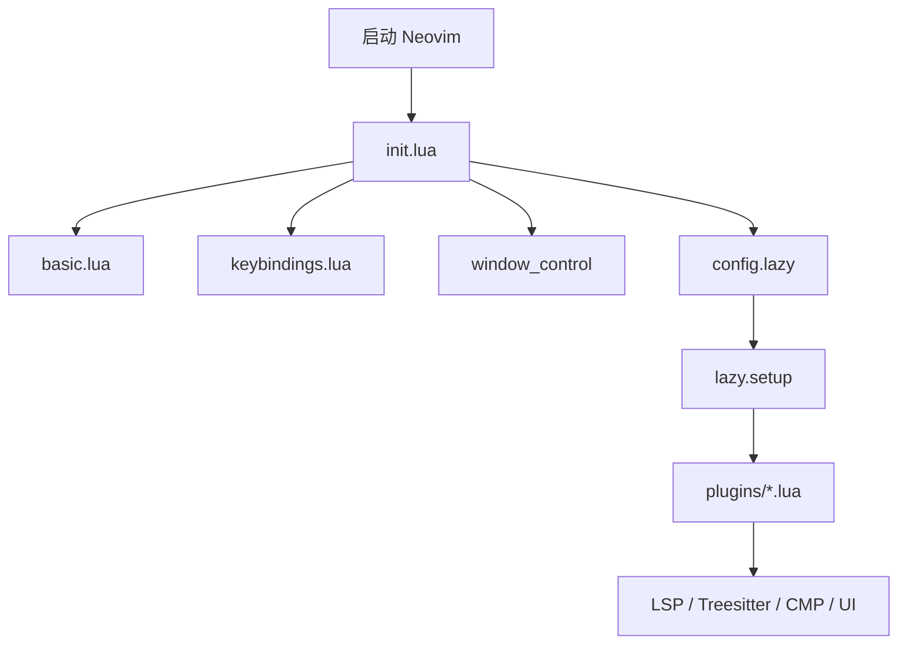

# Neovim Configuration

基于 Lua 的 Neovim 配置，使用 [lazy.nvim](https://github.com/folke/lazy.nvim) 管理插件。独立 Git 仓库，支持 macOS、Linux、Windows、WSL。

**要求**：Neovim **0.11.0+**、Git、安装脚本依赖 [uv](https://github.com/astral-sh/uv) 与 [fnm](https://github.com/Schniz/fnm)。

## 安装与更新

```bash
git clone <本仓库地址> ~/.config/nvim
cd ~/.config/nvim
chmod +x install.sh
./install.sh
```

更新：`git pull && ./install.sh`（Windows 也可双击或运行根目录 `install.cmd`）

无头验收：`./scripts/headless_validate.sh`（`install.sh` 末尾默认调用；`NVIM_SKIP_HEADLESS=1` 可跳过）

查看当前配置目录：`:echo stdpath('config')`（优先 `$XDG_CONFIG_HOME/nvim` 或 `~/.config/nvim`）。

Windows / `%APPDATA%` / Mason 等问题见 [TROUBLE_SHOOT.md](TROUBLE_SHOOT.md)。

## 跨编辑器统一配置（可选）

与终端 Neovim 共享编辑习惯时，可在 Cursor/VS Code 或 IntelliJ 系列 IDE 中部署子目录配置（与主 `init.lua`、Lazy 插件**相互独立**）。

| 运行时 | 配置入口 | 安装 |
|--------|----------|------|
| 终端 `nvim` | [init.lua](init.lua) + `lua/plugins/` | `./install.sh` 或根目录 `install.cmd` |
| Cursor / VS Code | [vscode_neovim_init.lua](vscode_neovim/vscode_neovim_init.lua) | `cd vscode_neovim && ./install.sh` |
| IntelliJ 系列 | [ideavimrc/.ideavimrc](ideavimrc/.ideavimrc) → `~/.ideavimrc` | `cd ideavimrc && ./install.sh` |

- **选项**：以 [lua/basic.lua](lua/basic.lua) 为单一来源；vscode-neovim 通过 `require("basic")` 加载，仅对嵌入层做少量覆盖；IdeaVim 使用 IdeaVim 支持的 `set` 子集（映射表见子 README）。
- **键位**：与 [lua/keybindings.lua](lua/keybindings.lua) 对齐；vscode 侧用 `VSCodeNotify` 映射编辑器命令，IdeaVim 侧 Neovim 优先、与 IDEA 冲突的键已改前缀。细节见 [vscode_neovim/README.md](vscode_neovim/README.md)、[ideavimrc/README.md](ideavimrc/README.md)。

Windows 可用根目录及各子目录下的 `install.cmd`（调用 Git Bash 执行 `install.sh`）。子安装排错见 [TROUBLE_SHOOT.md](TROUBLE_SHOOT.md#可选vscode-neovim--ideavim-安装排错)。

## 文档导航

| 文档 | 内容 |
|------|------|
| [docs/LSP_VIEW_AND_MANAGE.md](docs/LSP_VIEW_AND_MANAGE.md) | LSP 查看、Mason、键位、排错 |
| [TROUBLE_SHOOT.md](TROUBLE_SHOOT.md) | Windows 路径、install.sh、Mason |
| [docs/INVENTORY.md](docs/INVENTORY.md) | 文件/脚本/插件清单（当前基线） |
| [PROJECT_MEMORY.md](PROJECT_MEMORY.md) | 项目记忆（install.sh 同步到各 Agent 配置） |
| [docs/plugin_github_audit.txt](docs/plugin_github_audit.txt) | 当前启用插件的 GitHub 核查原始数据 |
| [ideavimrc/README.md](ideavimrc/README.md) | 可选：IntelliJ IdeaVim |
| [vscode_neovim/README.md](vscode_neovim/README.md) | 可选：Cursor/VS Code + vscode-neovim（`install.sh` 写入本机路径） |

## 项目结构

```
~/.config/nvim/
├── init.lua                 # 入口：basic → keybindings → window_control → lazy
├── install.sh               # 安装/依赖/路径注入
├── install.cmd              # Windows：Git Bash 调用 install.sh
├── lua/
│   ├── basic.lua
│   ├── keybindings.lua
│   ├── window_control.lua
│   ├── config/lazy.lua
│   └── plugins/             # 36 个插件规格文件
├── scripts/
│   ├── common.sh            # 日志/目录/Windows 环境辅助
│   ├── headless_validate.sh # 无头 Lazy + checkhealth 验收
│   └── bash.cmd             # Windows toggleterm 用 Git Bash（可配置）
├── ideavimrc/               # 可选：IdeaVim（.ideavimrc + install.sh/.cmd）
├── vscode_neovim/           # 可选：vscode-neovim（init + settings 模板 + install）
├── docs/
├── TROUBLE_SHOOT.md
├── PROJECT_MEMORY.md
└── lazy-lock.json
```

## 启动流程


```mermaid
flowchart TD
    A[启动 Neovim] --> B[init.lua]
    B --> C[basic.lua]
    B --> D[keybindings.lua]
    B --> E[window_control]
    B --> F[config.lazy]
    F --> G[lazy.setup]
    G --> H[plugins/*.lua]
    H --> I[LSP / Treesitter / CMP / UI]
```

## 核心模块

| 模块 | 职责 |
|------|------|
| `basic.lua` | 编码、UI、搜索、剪贴板、provider |
| `keybindings.lua` | Leader、hjkl 重映射、窗口、保存 |
| `window_control.lua` | 插件窗口智能缩放 |
| `config/lazy.lua` | lazy.nvim 引导 |
| `plugins/*.lua` | 按功能拆分的插件配置 |

## 快捷键概要

Leader 为 `<Space>`。光标：`i/k/j/l` 对应上/下/左/右（与 Vim 默认不同）。

| 类别 | 键位 | 说明 |
|------|------|------|
| 文件 | `S` | 保存 |
| 文件 | `<leader>Q` | 保存并退出 |
| 终端 | `<leader>/` | ToggleTerm（仅 toggleterm 一处定义） |
| 树 | `<leader>e` / `<leader>fe` | neo-tree 切换（`execute({ toggle })`；勿 `:q`/`<leader>q` 关侧栏，易 E95） |
| 树 | `<leader>fE` | neo-tree（当前文件所在目录） |
| 大纲 | `<leader>O` | outline |
| Tab | `[b` / `]b` / `<leader>[` / `<leader>]` | 当前分屏内切换 buffer（winbar，见下节） |
| Tab | `<leader>b` | 关闭当前分屏 tab（删 buffer） |
| 窗口 | `<leader>q` | 关闭当前分屏 window（**不**删 buffer / tab） |
| 窗口 | `<leader>wr` | 平衡窗口布局（`wincmd =`，终端 resize 乱了时用） |
| Tab | `<A-h/j/k/l>` | 将 buffer 移到相邻分屏 |
| 终端 | `Ctrl+Up/Down` | 调整当前窗口高度（toggleterm 限高 8～55% 屏高，`window_control.lua`） |
| LSP | `D` | 悬停（LSP buffer；全局 `K` 为下移 5 行） |
| LSP | `<leader>cf` | 格式化（conform，与保存时一致） |
| Mason | `<leader>cm` | Mason |
| 补全 | `Tab` / `Shift-Tab` | cmp（含 snippet 跳转；与 winbar/tab 无关） |
| 补全菜单 | `<C-f>` / `<C-b>` | 滚动文档（插入模式） |

完整列表：`:WhichKey` 或各 `lua/plugins/*.lua` 内 `keys`/`mappings`。

### 分屏 Tab（winbar）

每个编辑器组有自己的 tab 行——Neovim 里对应的是 **winbar**（每个 window 一条顶栏），不是 tabline。

| 组件 | 文件 | 状态 |
|------|------|------|
| [winbuf.nvim](https://github.com/e-sigs/winbuf.nvim) | `lua/plugins/ui_buffer_tabpage_winbuf.lua` | **启用** |
| [bufferline.nvim](https://github.com/akinsho/bufferline.nvim) | `lua/plugins/ui_buffer_tabpage_bufferline.lua` | **`enabled=false`**（全局 tabline，已由 winbuf 替代） |
| `showtabline` | `lua/basic.lua` | `0`（关闭全局 tabline 顶栏） |

键位见上表「Tab / 窗口 / 树」行；细节与 PROJECT_MEMORY #24 一致。LSP 与 Mason 详见 [docs/LSP_VIEW_AND_MANAGE.md](docs/LSP_VIEW_AND_MANAGE.md)。

## 插件 GitHub 状态

核查时间：2026-05-19（`gh api`，原始输出见 [docs/plugin_github_audit.txt](docs/plugin_github_audit.txt)）。

### 当前状态（启用插件）

| 仓库 | 状态 | 建议 |
|------|------|------|
| `mason-org/mason.nvim` / `mason-org/mason-lspconfig.nvim` | 已切换到上游组织 | 与当前上游一致 |
| `neovim-treesitter/nvim-treesitter` | 已切换到活跃仓库 | 分支已改为 `main` |
| [folke/snacks.nvim](https://github.com/folke/snacks.nvim) | 已启用 input/picker | 替代 archived 的 dressing 选择/输入 UI |
| [numToStr/Comment.nvim](https://github.com/numToStr/Comment.nvim) | 最近推送 2024-08 | 仍可用；长期可观察迁移方案 |
| [saadparwaiz1/cmp_luasnip](https://github.com/saadparwaiz1/cmp_luasnip) | 最近推送 2024-11 | 仍可用；关注 cmp/LuaSnip 大版本 |
| [e-sigs/winbuf.nvim](https://github.com/e-sigs/winbuf.nvim) | **启用**；分屏 winbar tab | 每 window 独立 tab 行；见 README「分屏 Tab」 |
| [akinsho/bufferline.nvim](https://github.com/akinsho/bufferline.nvim) | **`enabled=false`** | 全局 tabline，已由 winbuf 替代；规格仍保留便于回滚 |
| [akinsho/toggleterm.nvim](https://github.com/akinsho/toggleterm.nvim) | 2025 初后较少提交 | 功能正常，升级前看 changelog |
| [nvim-pack/nvim-spectre](https://github.com/nvim-pack/nvim-spectre) | 2025-05 后较少提交 | 仍可用 |

### 历史归档仓库（已移除或替换）

- `folke/neodev.nvim` → 使用 `folke/lazydev.nvim`
- `nvim-treesitter/nvim-treesitter` → 使用 `neovim-treesitter/nvim-treesitter`
- `stevearc/dressing.nvim` → 使用 `folke/snacks.nvim`（input/picker）

## 配置冲突与治理

以下项已在本次整治中**处理**或**文档化**；机制说明便于后续维护。

| 优先级 | 冲突 | 机制 | 处理 |
|--------|------|------|------|
| **高** | `<Tab>` cmp vs LuaSnip | 两处 `i` 模式 Tab 映射 | LuaSnip 的 `keys` 已移除，由 cmp 统一 |
| **高** | `<C-f>`/`<C-b>` cmp vs noice | 插入模式同键 | noice 滚动限制为 `n`/`s`，cmp 保留 `i` |
| **高** | Python `pyright` + `ruff_lsp` | 双 LSP 诊断 | pyright 关闭 publishDiagnostics，ruff 负责 lint |
| **高** | 保存 conform vs `<leader>cf` LSP format | 不同格式化路径 | `<leader>cf` 改为 `conform.format()` |
| **高** | `<leader>/` 三处定义 | keybindings + toggleterm ×2 | keybindings 与 toggleterm 重复映射已删，仅 lazy `keys` |
| **中** | mason-lspconfig 默认 handler | 空 `{}` 二次 `vim.lsp.enable` | handler 改为 no-op，由 lspconfig 主配置 enable |
| **中** | neo-tree `S` vs 全局保存 `S` | 树内水平分屏占键 | 树内改为 `s` 打开分屏 |
| **中** | neo-tree `document_symbols` + outline | 双符号侧栏 | 已移除 neo-tree 的 `document_symbols`，保留 outline |
| **中** | hardtime 在特殊 UI buffer 抢键 | 侧栏/选择器体验受影响 | 已加入 `neo-tree`/`mason`/`DressingSelect` 白名单 |
| **低** | `[b`/`]b` 与 `<leader>[`/`]` | 别名 | 保留，which-key 说明即可 |
| **低** | winbuf + lualine 诊断 | 分屏 tab 与状态栏均可能显示诊断 | 可关 winbuf `diagnostics` 或保留 buffer 内 virtual text |

验证：

```vim
:verbose imap <Tab>
:verbose imap <C-f>
:verbose nmap <leader>/
:lua print(vim.inspect(vim.tbl_map(function(c) return c.name end, vim.lsp.get_clients())))
```

## 维护建议

0. **插件规格文件头注释**（`lua/plugins/*.lua`）统一三行格式，仅改文件头、不改 spec/config 逻辑：

```lua
-- owner/repo
-- 一行中文功能说明
-- https://github.com/owner/repo
```

1. `opencode` 的 `go`/`goo` 可迁移到 `<leader>a…` 前缀，减少与内置 `g` 序列冲突。
2. `vscode_neovim/settings.json` **勿提交本机** `neovimInitVimPaths`；路径由 `vscode_neovim/install.sh` 写入用户 `User/settings.json`；改模板编辑器项后重新运行该安装脚本。
3. 定期执行 `:Lazy update`、`:MasonUpdate`、`:checkhealth`。
4. 改 `basic.lua` / `keybindings.lua` 时同步检查 `vscode_neovim_init.lua` 与 `ideavimrc/.ideavimrc`（子 README 含 `basic.lua` 映射表）。
5. 改终端 LSP 键位（`gd` 等）时同步 [vscode_neovim/vscode_neovim_init.lua](vscode_neovim/vscode_neovim_init.lua) 的 `VSCodeNotify` 映射；嵌入层依赖编辑器语言扩展（如 clangd），见 [vscode_neovim/README.md](vscode_neovim/README.md)。

## 健康检查

```vim
:checkhealth
```

推荐维护顺序（无头，需先 `eval "$(fnm env --use-on-cd)"`）：

```bash
./install.sh
nvim --headless -u init.lua -c "Lazy! update" -c "qa!"
nvim --headless -u init.lua \
  -c "lua vim.wait(25000, function() return pcall(require,'nvim-treesitter.configs') end)" \
  -c "checkhealth" -c "w! docs/nvim_checkhealth_final.log" -c "qa!"
```

细节与排错见 [`.cursor/rules/headless-testing.mdc`](.cursor/rules/headless-testing.mdc)。缺失工具可由 `./install.sh` 安装。

**代理（默认启用）：** `scripts/common.sh` 的 `setup_default_proxy` 在 `install.sh` 与无头验收开头执行——本机 `127.0.0.1:7890`，WSL 自动解析宿主机 IP；2s 探测不可达则跳过，避免 git/npm 挂起。关闭：`env USE_PROXY=0 ./install.sh`；覆盖：`PROXY_HOST` / `PROXY_PORT`。直接启动 `nvim` 时 `basic.lua` 会按相同规则自动设置（已有 `http_proxy` 或 `NVIM_PROXY_URL` 时不覆盖）。

## 维护

- 插件按 `lua/plugins/<功能>_<插件名>.lua` 命名。
- 改插件后：`:Lazy sync`；改 LSP 工具：`:MasonUpdate`。
- 整治后更新图谱：`graphify update .`（若使用 graphify）。

## 参考链接

- [Neovim 文档](https://neovim.io/doc/user/)
- [lazy.nvim](https://github.com/folke/lazy.nvim)
- [本仓库](https://github.com/xiaolitongxue666/nvim)
